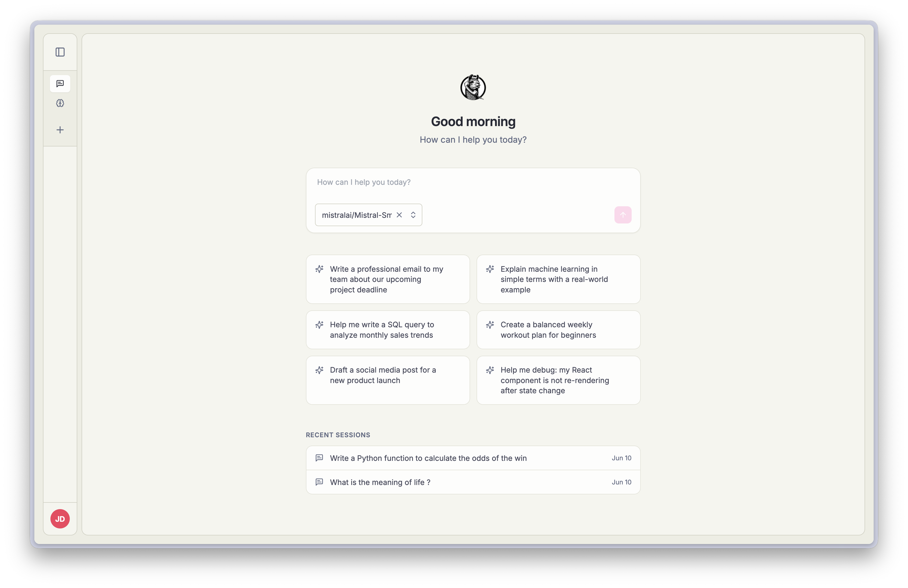
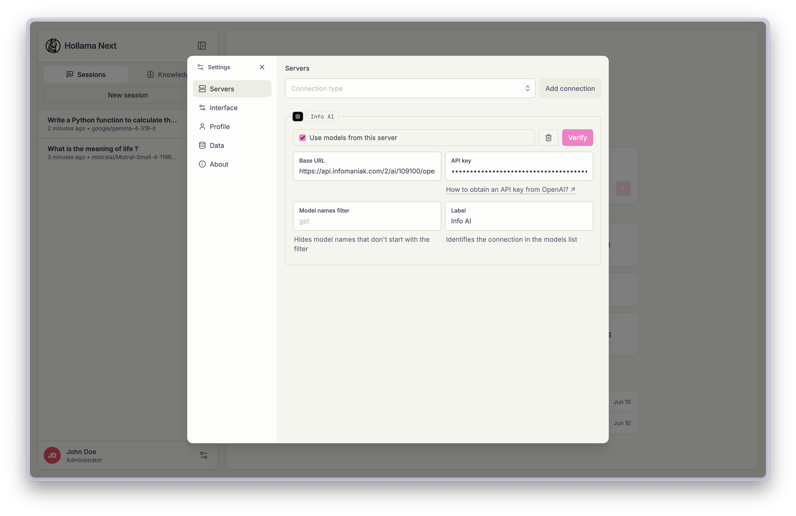

# Hollama Next

> **Disclaimer** — This project is an **early preview**. Not made for production use. Expect breaking changes, unfinished features, and rough edges.
>
> I'm not a professional developer and I'm still learning. I've made heavy use of AI assistance while trying to remain responsible. Any audit, suggestion or PR are more than welcome. If that's not your thing, no hard feelings — just being transparent.

A minimal LLM chat app that runs _entirely_ in your browser.

This is a fork of [Hollama](https://github.com/fmaclen/hollama) by [fmaclen](https://github.com/fmaclen) — many thanks for the original work.

### Features

- Support for **Ollama** & **OpenAI** servers
- Multi-server support
- Text & vision models
- Large prompt fields
- Support for reasoning models
- Markdown rendering with syntax highlighting
- KaTeX math notation
- Code editor features
- Customizable system prompts & advanced Ollama parameters
- Copy code snippets, messages or entire sessions
- Edit & retry messages
- Stores data locally on your browser
- Import & export stored data
- Responsive layout
- Light & dark themes
- Multi-language interface
- Download [Ollama models](https://ollama.ai/models) directly from the UI

### Roadmap

- [x] Remove Electron (replaced by Tauri)
- [x] Server-side proxy for OpenAI-compatible providers (CORS bypass)
- [x] Settings modal (replaces `/settings` route)
- [x] Theme system (System / Light / Dark + Classic / Dracula / Catppuccin)
- [x] Welcome page redesign (chat input, suggestion chips, recent sessions)
- [x] URL param auto-submit (`?q=`, `&model=`)
- [x] Default model setting
- [x] Profile settings (name, avatar, color)
- [x] Avatar + name in sidebar
- [ ] Tauri desktop builds (macOS / Windows / Linux)
- [ ] Auth.js & multi-user support
- [ ] Testing & polish

### Get started

- ⚡️ Live demo — _coming soon_
- 🖥️ Download — _coming soon_ (will be replaced by Tauri)
- 🐞 [Contribute](CONTRIBUTING.md)

### Self-hosting

Docker images are published to [`ghcr.io/cedhuf/hollama`](https://ghcr.io/cedhuf/hollama) as a **rolling release** — every push to `main` automatically updates the `:latest` tag.

**Quick start with Docker Compose (recommended):**

```shell
cp .env.example .env
docker compose up -d
```

Then open [http://localhost:4173](http://localhost:4173).

**Or with Docker directly:**

```shell
docker run --rm -d -p 4173:4173 --name hollama ghcr.io/cedhuf/hollama:latest
```

**Update to the latest version:**

```shell
docker compose pull && docker compose up -d
```

**Connecting to an Ollama server on a different device** — if your Ollama server is running on a separate machine, you need to allow your Hollama instance's domain in `OLLAMA_ORIGINS`. [Learn more in Ollama's docs](https://github.com/ollama/ollama/blob/main/docs/faq.md#how-do-i-configure-ollama-server).

```shell
OLLAMA_ORIGINS=https://your-hollama-domain.com ollama serve
```

**Configuration** — copy `.env.example` to `.env` and adjust as needed:

| Variable | Default | Description |
|---|---|---|
| `HOST_PORT` | `4173` | Port exposed on the host |
| `VITE_ALLOWED_HOSTS` | `localhost` | Comma-separated allowed domains (useful behind a reverse proxy) |

|          |    |
| -------------------------------------------------- | ---------------------------------------------- |
|  |  |

### License

[MIT](LICENSE)
