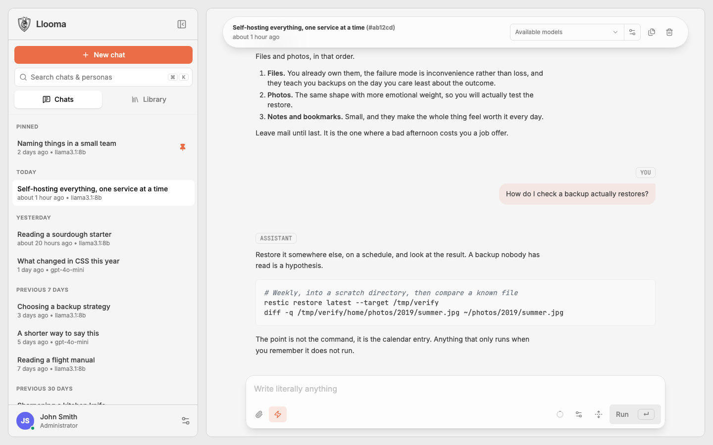
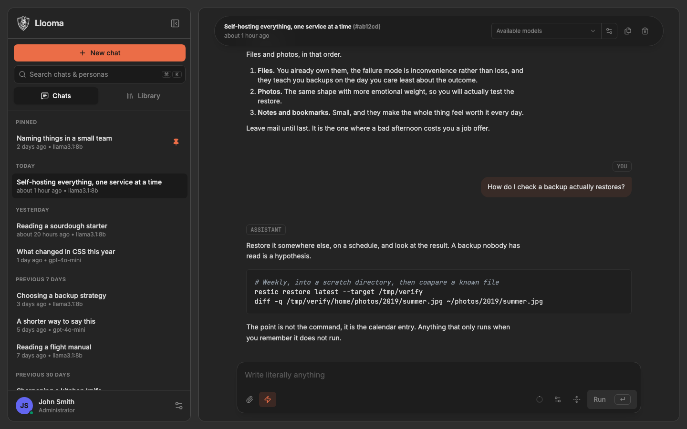
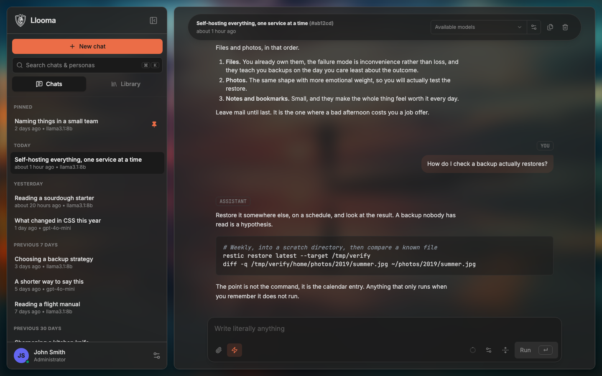
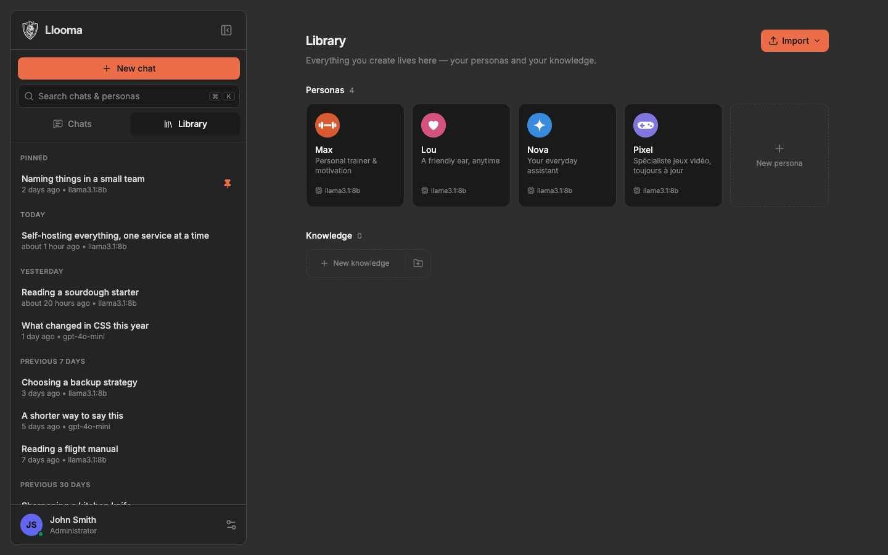
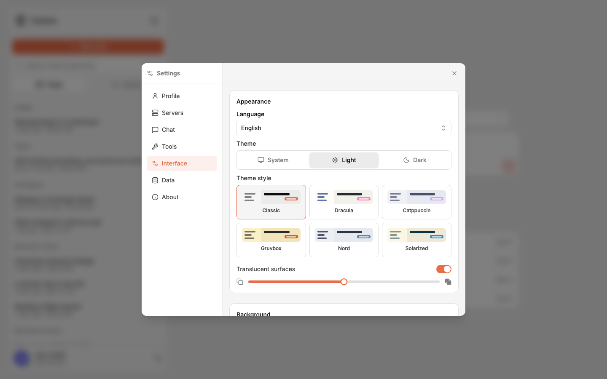
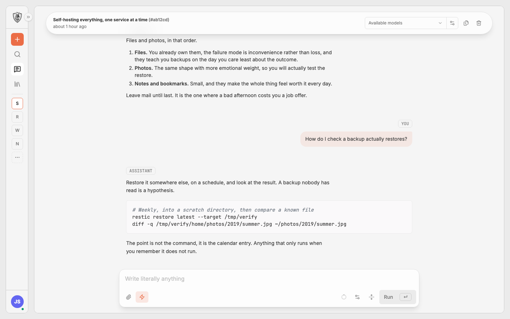
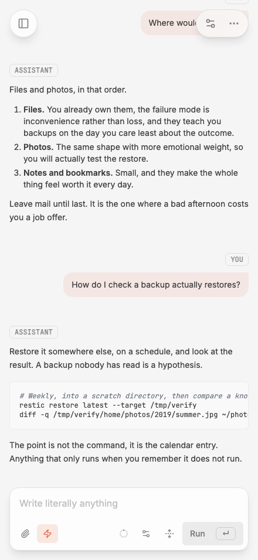
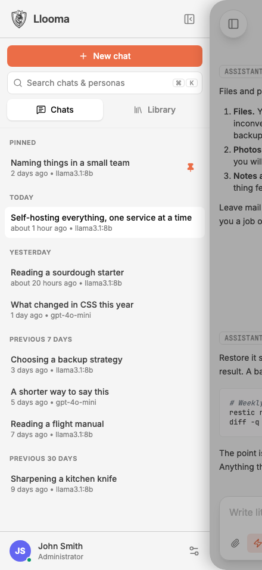
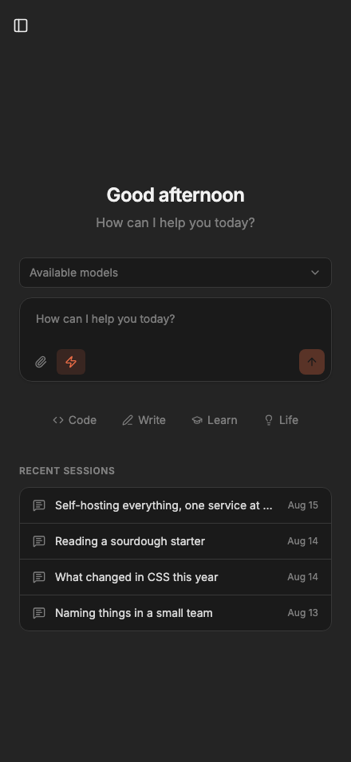

<div align="center">

<picture>
  <source media="(prefers-color-scheme: dark)" srcset="static/logo-mark-dark.png" />
  
</picture>

# Llooma /ˈluː.mə/

**A (less) minimal LLM chat app you host yourself.**

[Documentation](https://llooma.eu) · [Roadmap](https://llooma.eu/roadmap/) · [Changes from Hollama](https://llooma.eu/changes-from-hollama/)

This is a fork of [Hollama](https://github.com/fmaclen/hollama) by [fmaclen](https://github.com/fmaclen).

</div>

> [!IMPORTANT]
> **Local mode is gone**. If you were using it, export a backup from _Settings → Data → Backup & restore_ **before** you update, and restore it afterwards.
>
> More details on why in [Discussions](https://github.com/cedhuf/llooma/discussions).


> [!WARNING]
> This project is an **early preview**. Not made for production use. Expect breaking changes, unfinished features, and rough edges. You are warned 😅
>
> I'm not a professional developer and I'm still learning. I've made use of AI assistance while trying to remain responsible. Any audit, suggestion or PR is more than welcome. If AI is not your thing, you can check the original project instead, or check [Similar projects].

## What it is

Bring your own models, from Ollama, OpenAI, Claude, Infomaniak or anything OpenAI-compatible, and
chat with them from an app that is yours.

- **Personal or shared.** With nothing configured it is yours alone, with no login screen and an
  owner created on first run. Configure a way to sign in and the same install stores each account's
  data separately, keeping the API keys where a browser can never read them.
- **Personas.** Give a model a face, a voice and a name. A coach, a tutor, a companion, each with
  its own avatar, prompt, model, greeting and knowledge. Import existing ones, including OpenWebUI
  exports, and share them across a team.
- **Knowledge and documents.** Write down what you keep re-explaining and attach it anywhere. Drop
  in a PDF, a spreadsheet or a Word file and it is read _in your browser_, never uploaded.
- **Tools that stay yours.** Web search, page reading, interactive choices. Every instruction behind
  them is a text box you can rewrite.
- **Replies that survive the page.** A generation runs in the server, so reloading, navigating away
  or letting your phone sleep no longer costs you the answer: the conversation picks it back up
  where it was. Switch it off in one click if you would rather nothing left the tab.
- **Compaction.** When a conversation gets too long, `/compact` replaces what was said with a
  structured summary so it keeps fitting. Nothing is deleted, and one click puts it all back.
- **Full-text search** across every conversation, answering with the passage itself.
- **Six themes**, each with a light and a dark ramp, English and French, installable as a PWA.

The [documentation](https://llooma.eu/features/) covers each of these properly.

## Get started

```shell
docker run --rm -d -p 4173:4173 --name llooma ghcr.io/cedhuf/llooma:latest
```

Then open <http://localhost:4173>. Nothing is persisted without a volume, so bind-mount `DATA_DIR`
before you put anything in it.

For a real deployment, Docker Compose, accounts, every environment variable, and the security notes
that matter before exposing an instance:

- [Installation](https://llooma.eu/guides/installation/)
- [Personal or shared](https://llooma.eu/guides/running-modes/)
- [First run](https://llooma.eu/guides/first-run/)
- [Configuration](https://llooma.eu/reference/configuration/)
- [Security](https://llooma.eu/guides/security/)

## Contributing

> [!IMPORTANT]
> Feel free to participate ! I would love to have some feedback on everything you feel about this project, or issues you may encounter. To keep the project manageable please note that **issues are for bugs only**. For a feature request or anything else, please open a discussion. If the community backs it, and we agree on the technical approach, it will become an issue. Thanks!

See [CONTRIBUTING.md](CONTRIBUTING.md), and
[Working on Llooma](https://llooma.eu/development/) for how the codebase is laid out.

## Screenshots


_The six themes, left to right: Classic, Dracula, Catppuccin, Gruvbox, Nord and Solarized. Light
ramps on the top row, dark on the bottom._

|  |  |    |
| -------------------------------------------------------------- | -------------------------------------------------------------- | ---------------------------------------------------------- |
|              |  |  |

### On a phone

|  |  |  |
| ------------------------------------------------------------- | ------------------------------------------------------------ | ------------------------------------------------------ |

## Similar projects

Llooma is not trying to be the biggest of these. It is meant to be small enough to read, to run in
one container, and to have accounts only when you actually need them. If that is not what you are
after, one of these probably is.

- **[Hollama](https://github.com/fmaclen/hollama)** is what this is forked from: smaller still, no
  accounts, no server. If you want one person, one browser, nothing else, start there. What we
  changed is listed in [Changes from Hollama](https://llooma.eu/changes-from-hollama/).
- **[hollama-spark](https://github.com/cwright814/hollama-spark)** is another fork of it, aimed at
  running local models well.
- **[OrionChat](https://github.com/EliasPereirah/OrionChat)** runs in the browser with no build
  step, talks to many providers, and does things we do not: text to speech, speech to text, and
  previewing HTML a model writes.
- **[Open WebUI](https://github.com/open-webui/open-webui)**,
  **[LibreChat](https://github.com/danny-avila/LibreChat)** and
  **[Lobe Chat](https://github.com/lobehub/lobe-chat)** are the large ones. They do far more than
  this: pipelines, plugin ecosystems, retrieval over your documents, whole admin surfaces. They also
  ask more of you to run and to keep running.
- **[AnythingLLM](https://github.com/Mintplex-Labs/anything-llm)** and
  **[Jan](https://github.com/menloresearch/jan)** come at it from the desktop instead of the server.

[every-chatgpt-gui](https://github.com/billmei/every-chatgpt-gui) keeps the exhaustive list, which
is longer than anyone expects!

## License

[MIT](LICENSE)

Document reading is powered by [officeparser](https://github.com/harshankur/officeParser) (MIT) and
[pdf.js](https://mozilla.github.io/pdf.js/) (Apache-2.0).
