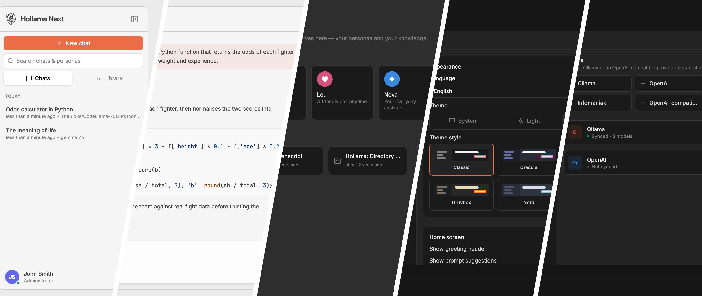
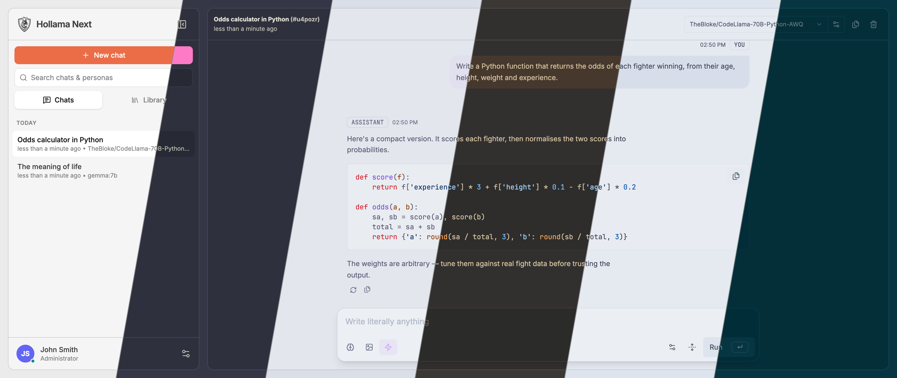
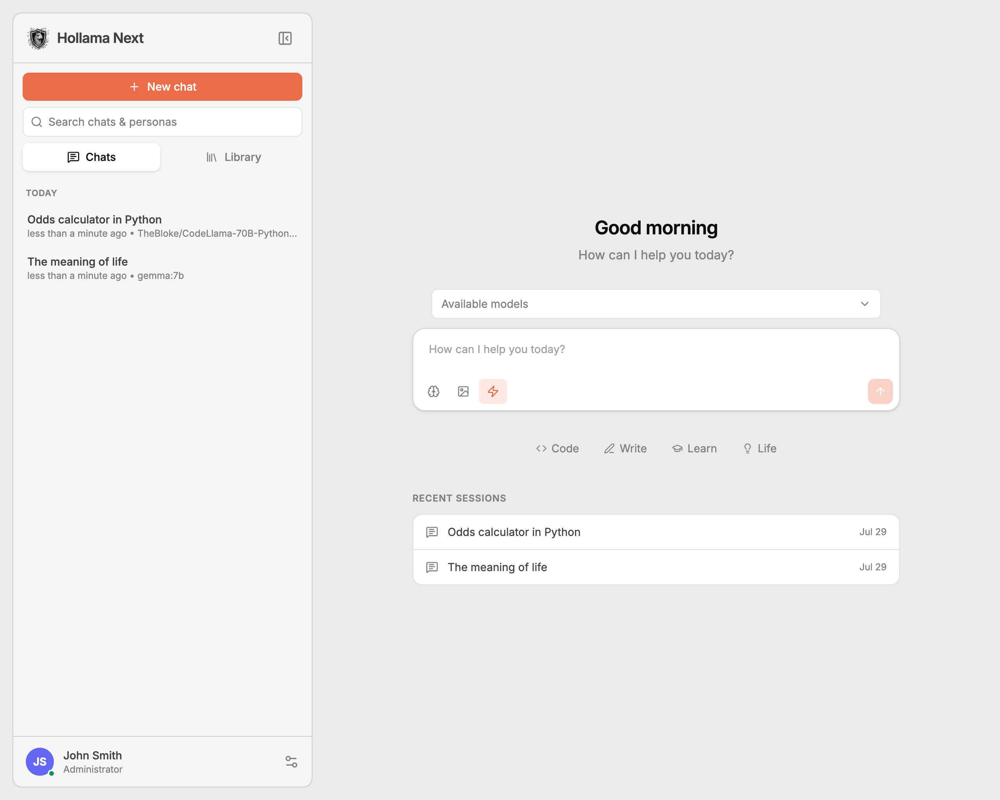
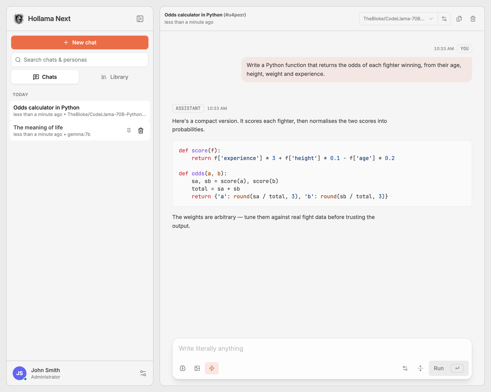
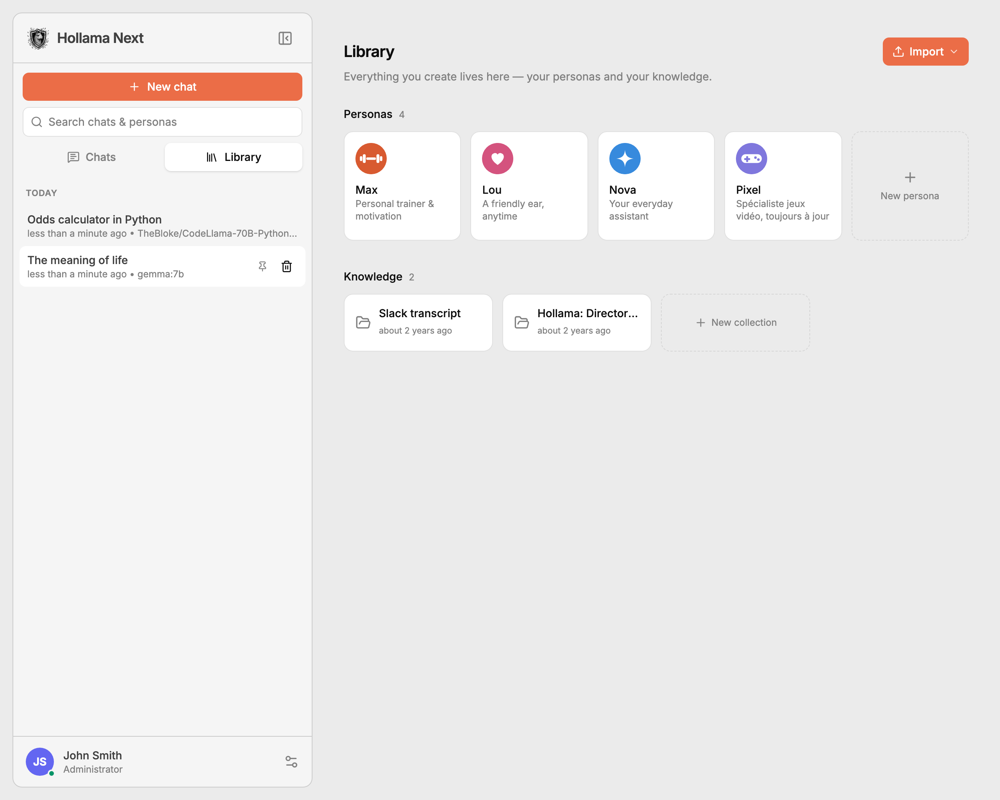
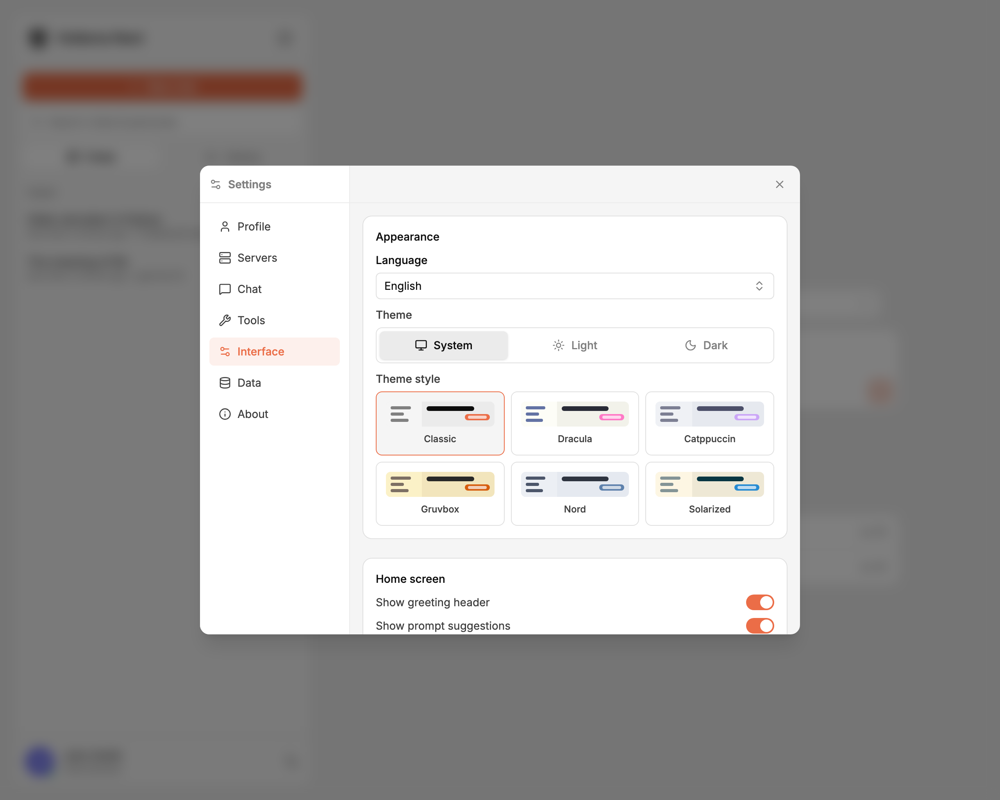
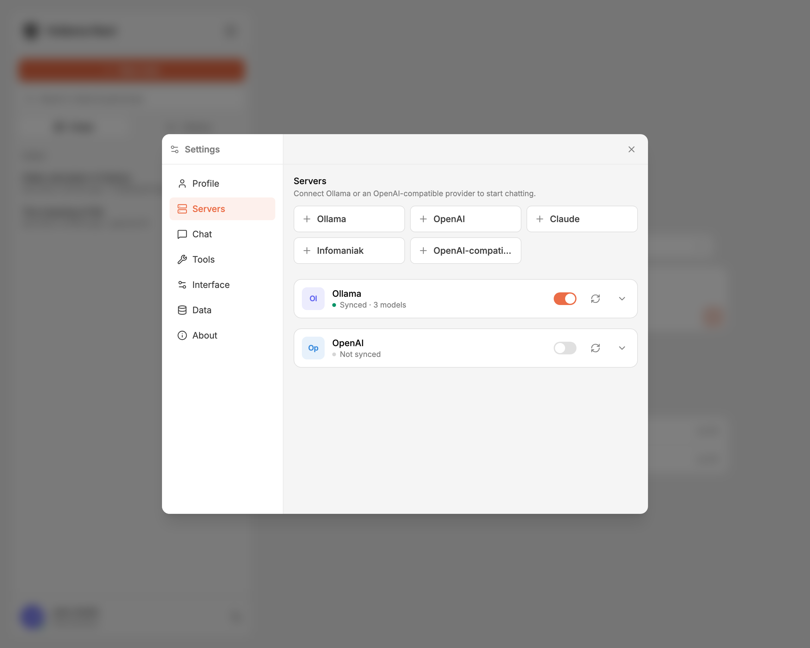
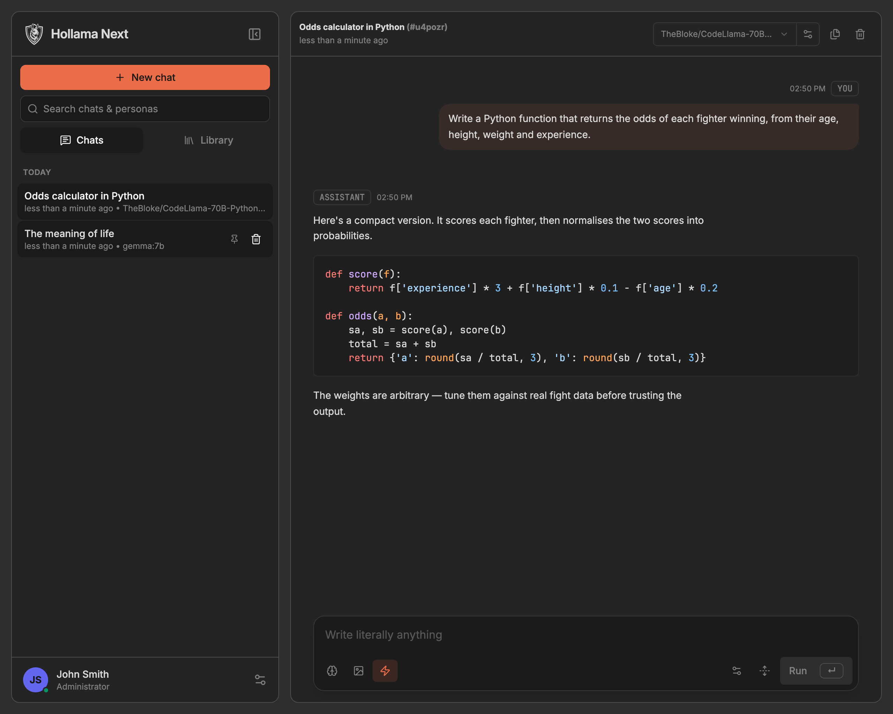

<div align="center">

<!-- The mark is black ink on transparency, so it disappears on GitHub's dark
     theme; `<picture>` swaps in the inverted copy there. -->
<picture>
  <source media="(prefers-color-scheme: dark)" srcset="static/logo-mark-dark.png" />
  
</picture>

# Hollama Next

**A (less) minimal LLM chat app that runs _entirely_ in your browser.**


<!-- The seams are punched out of the alpha channel rather than painted, so this
     one banner sits on either GitHub theme. Regenerated by `tests/docs.test.ts`. -->



</div>

> [!WARNING]
> **Disclaimer** — This project is an **early preview**. Not made for production use. Expect breaking changes, unfinished features, and rough edges.
>
> I'm not a professional developer and I'm still learning. I've made use of AI assistance while trying to remain responsible. Any audit, suggestion or PR are more than welcome. If that's not your thing, you can check the original project instead or other forks, no hard feelings — just being transparent.
>
> Recent work has focused on the **server / multi-user** mode. The **standalone (local)** mode may have temporary inconsistencies that still need a verification pass.

This is a fork of [Hollama](https://github.com/fmaclen/hollama) by [fmaclen](https://github.com/fmaclen) — many thanks for the original work.

---

<div align="center">

### ✨ Introducing Personas

**Give your AI a face, a voice and a name.**

Build characters — a coach, a tutor, a companion — each with its own avatar, system prompt, model, greeting and knowledge, then chat with them as one ongoing relationship. Import existing ones (OpenWebUI-compatible), pin your favourites to the sidebar, and in server mode share them across your team.

</div>

---

> [!IMPORTANT]
> Feel free to participate — there is no bad contribution. One rule to keep the project manageable: **issues are for bugs only**. For a feature request or anything else, please open a discussion; if the community backs it, it will become an issue. Thanks!

### Features

**Providers**

- Ollama, OpenAI, Claude, Infomaniak, and any OpenAI-compatible server
- One-click presets — pick a provider, paste an API key
- Several connections at once, each with its own label and colour, shown wherever its models appear
- Custom display names per model, so `mistral/Mistral_Small-24B-Instruct` can read as you like
- Model name filter per connection
- Download [Ollama models](https://ollama.ai/models) directly from the UI

**Chat**

- Text, vision and reasoning models, with streamed replies
- Markdown with syntax highlighting, KaTeX maths, and copyable code blocks
- Attach **knowledge** and **images** from the composer, on the home screen and in any conversation
- Edit and retry messages; copy a message, a code block, or a whole conversation (JSON or Markdown)
- **Web search** — [degoog](https://github.com/degoog-org/degoog) or SearXNG, toggled per message, with an optional _let the model decide_ mode and a live status. Configurable from the GUI, lockable instance-wide via env, shareable by an admin
- **Interactive choices** — when a request is ambiguous, the model can offer tappable options instead of guessing
- **System prompts** — global, per-model and per-conversation
- AI-generated conversation titles, using a dedicated (cheap) model
- Advanced Ollama parameters

**Personas & knowledge**

- Reusable characters with their own avatar, system prompt, model, greeting and knowledge, created in the **Library** and pinned to the sidebar
- Import personas from a file, including OpenWebUI model exports; three starter personas ship by default
- Knowledge collections attachable to any conversation or persona

**Interface**

- Six themes — Classic, Dracula, Catppuccin, Gruvbox, Nord and Solarized — each with a light and a dark ramp, following the system by default
- Responsive; dialogs go full screen on phones; installable as a PWA
- English and French, with automatic English fallback for untranslated keys
- Import and export each kind of data, or a full backup of everything

### Roadmap

- [ ] Tauri desktop builds (macOS / Windows / Linux)
- [x] Auth.js & multi-user support
- [ ] **Enforce sharing server-side** — today "shared models" and "locked" prompts/search are GUI-level only, not a real security boundary (a technical user can still call any model on a system server or send their own system prompt). Enforce model allow-lists and locked prompts in the proxy.
- [ ] User groups — per-group default prompts / models
- [ ] **Protect locked prompts from personas** — a persona's system prompt currently replaces the global one, so a modifiable shared persona can override a protective (e.g. child-safety) instance prompt. Enforce that locked instance prompts always apply, even under a persona
- [ ] **Reusable playbooks** — write step-by-step instructions in Markdown once and reuse them in any conversation (a "how-to" the model follows, separate from a persona's system prompt)
- [ ] **Slash shortcuts** — save frequently used instructions and fire them by typing `/shortcut` in the composer, with an optional popup form (text fields, dropdowns, dates) for variables, so no one has to remember the exact wording
- [x] **Revisit translations** — English and French are complete (`pnpm run i18n:status`); other locales were dropped, and adding one back no longer means auditing every key
- [ ] Finish the Svelte 5 migration — four legacy `on:` directives remain, all in `FieldInput.svelte`
- [ ] Testing & polish

> For everything already done in this fork, see [CHANGES.md](CHANGES.md).

### Get started

- ⚡️ Live demo — _coming soon_
- 🖥️ Download — _coming soon_ (will be replaced by Tauri)
- 🐞 [Contribute](CONTRIBUTING.md)

### Self-hosting

Docker images are published to [`ghcr.io/cedhuf/hollama`](https://ghcr.io/cedhuf/hollama) as a **rolling release** — every push to `main` automatically updates the `:latest` tag.

**Quick start with Docker Compose (recommended):**

```shell
cp .env.example .env
docker compose up -d
```

Then open [http://localhost:4173](http://localhost:4173).

**Or with Docker directly:**

```shell
docker run --rm -d -p 4173:4173 --name hollama ghcr.io/cedhuf/hollama:latest
```

**Update to the latest version:**

```shell
docker compose pull && docker compose up -d
```

**Connecting to an Ollama server on a different device** — if your Ollama server is running on a separate machine, you need to allow your Hollama instance's domain in `OLLAMA_ORIGINS`. [Learn more in Ollama's docs](https://github.com/ollama/ollama/blob/main/docs/faq.md#how-do-i-configure-ollama-server).

```shell
OLLAMA_ORIGINS=https://your-hollama-domain.com ollama serve
```

**Running modes** — Hollama runs in one of two modes, chosen at deploy time with `PUBLIC_MODE`:

> [!NOTE]
> Why ?
>
> - This allow device synchronization, which was not possible before.
> - This also allow multiple user instance.

---

- **`local`** (default) — single-user, browser-only. All data (sessions, knowledge, server connections, preferences) lives in the browser's `localStorage`, and you bring your own LLM providers (Ollama, OpenAI, Claude, …) from _Settings → Servers_. No accounts, no database. Ideal for personal use, a phone PWA, or the upcoming desktop app.
- **`server`** — multi-user, self-hosted. Users sign in (email + password and/or OIDC), data is stored server-side in SQLite **per user**, and **provider API keys never leave the server** (encrypted at rest). An admin configures shared providers and which models to expose; optionally, users may add their own keys (`allowUserKeys`).

Set `PUBLIC_MODE=server` to enable server mode. All server-mode state lives under `DATA_DIR` — a single directory you can bind-mount to persist everything.

**Configuration** — copy `.env.example` to `.env` and adjust as needed.

_Common (both modes):_

| Variable                    | Default     | Description                                                                                                                                                  |
| --------------------------- | ----------- | ------------------------------------------------------------------------------------------------------------------------------------------------------------ |
| `HOST_PORT`                 | `4173`      | Port exposed on the host                                                                                                                                     |
| `VITE_ALLOWED_HOSTS`        | `localhost` | Comma-separated allowed domains (useful behind a reverse proxy)                                                                                              |
| `PROXY_ALLOWED_ORIGINS`     | _(empty)_   | Allowlist of provider origins the proxy may forward to; empty = **any** (see the warning below)                                                              |
| `PUBLIC_DISABLE_ONBOARDING` | _(unset)_   | `true` skips the first-run wizard (local mode)                                                                                                               |
| `PUBLIC_OLLAMA_URL`         | _(unset)_   | Pre-configure an Ollama server on a fresh install (local mode)                                                                                               |
| `PUBLIC_SEARCH_URL`         | _(unset)_   | Web search backend ([degoog](https://github.com/degoog-org/degoog) / SearXNG). When set, it's locked instance-wide; if unset, it's configurable from the GUI |
| `PUBLIC_SEARCH_BACKEND`     | `degoog`    | `degoog` or `searxng`                                                                                                                                        |

> [!WARNING]
> **Set `PROXY_ALLOWED_ORIGINS` on any instance reachable from the internet.** The
> provider proxy (`/api/proxy/…`) forwards to whatever origin it is given and does
> not require a signed-in user, so with the default empty allowlist an instance is
> an open proxy for anyone who can reach it. Restricting it to your providers'
> origins closes that.

_Server mode (`PUBLIC_MODE=server`):_

| Variable                                | Default                | Description                                                                         |
| --------------------------------------- | ---------------------- | ----------------------------------------------------------------------------------- |
| `PUBLIC_MODE`                           | `local`                | Set `server` for multi-user mode                                                    |
| `DATA_DIR`                              | `./data`               | Directory for the SQLite DB and server state (bind-mount this)                      |
| `AUTH_SECRET`                           | —                      | **Required.** Signs sessions and encrypts provider keys (`openssl rand -base64 32`) |
| `ADMIN_EMAIL`                           | —                      | Bootstraps the first admin; also marks this email as admin for OIDC                 |
| `ADMIN_PASSWORD`                        | —                      | Initial admin password (omit for an OIDC-only admin)                                |
| `AUTH_CREDENTIALS`                      | —                      | `true` to enable email + password login                                             |
| `OIDC_ISSUER`                           | —                      | OIDC provider URL (e.g. PocketID); its presence enables OIDC login                  |
| `OIDC_CLIENT_ID` / `OIDC_CLIENT_SECRET` | —                      | OIDC client credentials                                                             |
| `OIDC_NAME`                             | `SSO`                  | Label for the OIDC sign-in button                                                   |
| `OIDC_SCOPE`                            | `openid profile email` | Requested scopes (add your groups scope to expose roles)                            |
| `OIDC_ROLE_CLAIM` / `OIDC_ADMIN_VALUE`  | —                      | Claim and value that grant the admin role                                           |
| `OIDC_AUTO_PROVISION`                   | `true`                 | Create a user on first OIDC login (`false` requires a pre-created account)          |
| `OIDC_AUTO_REDIRECT`                    | —                      | `true` skips the login page and goes straight to the IdP (OIDC-only)                |

> OIDC redirect URI to register with your provider: `https://your-hollama-domain/auth/callback/oidc`

### Screenshots



_The six themes, left to right: Classic, Dracula, Catppuccin, Gruvbox, Nord and Solarized — alternating light and dark ramps._

|                    |      |         |
| ------------------------------------------------------ | ----------------------------------------------------- | ------------------------------------------------- |
|  |  |  |

### License

[MIT](LICENSE)
